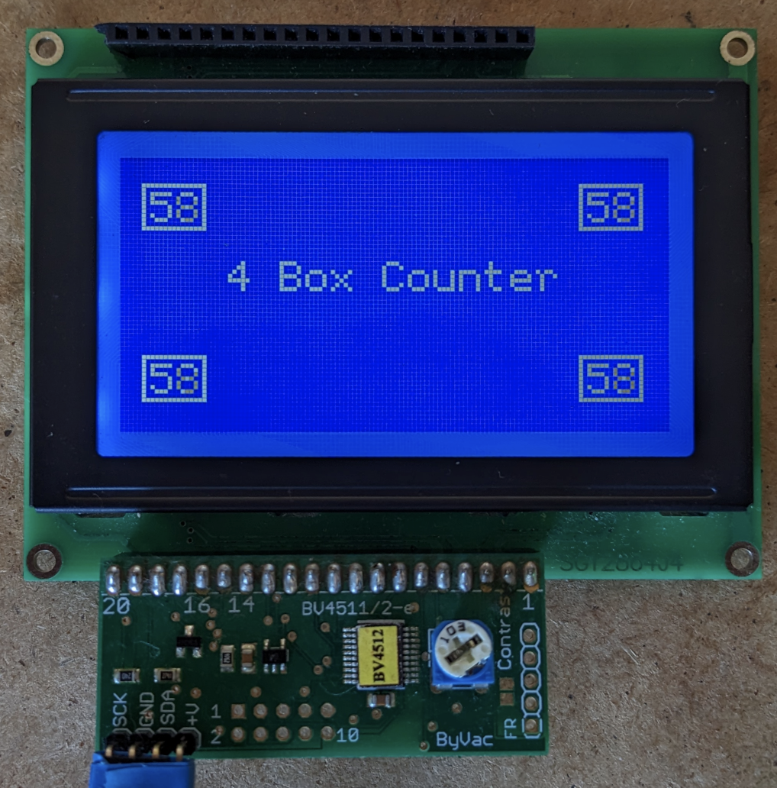

# BV4512 (I2C) 128x64 Display Controller
Library for an old and rare I2C display controller for 168x64 graphical LCD panels (such as the SG12864J4).  Found the screen in an old electronics box, and it was difficult to find the library so posting it here.

This is the original library, with a few updates to make it work with recent Arduino environments (Arduino 2.21).

I was unable to get this I2C controller to work with any newer libraries (U8g2, 
U8x8, openGLCD).



## Datasheets

- [BV4511-2_Controller_DataSheet.pdf](datasheets/BV4511-2_Controller_DataSheet.pdf)
- [BV4512_DataSheet.pdf](datasheets/BV4512_DataSheet.pdf)

## Usage
- Default I2C address:  0x21
- Refer to the example .ino sketches 
- More commands are available, see bv4512.cpp

### Clear screen 

```
di.cls();
```

### Invert drawing colour 
- Inverts the drawing colour of any commands that follow
- Use in front of .cls() to invert entire screen
```
di.colour(1); // default is 0, set to 1 for invert
```

### Set cursor position and draw text 
```
di.rcPos(1,1);
di.print("Hello");
```


### Draw lines

```
di.hline(30,15,40); // horizontal line -  h pos, v pos, length
di.vline(30,15,40); // vertical line - h pos, v pos, length
```

### Draw rectangles (outline and filled)

```
di.rectangle(5,46,15,11); // rectangle outline -  x pos, y pos, x length, y length
di.box(107,46,15,11);     // rectangle filled  -  x pos, y pos, x length, y length
```

### Draw a single pixel 
- Not affected by di.colour()

```
di.xyPix(0, 0, 1); // x pos, y pos, pixel off/on
```

### Draw fill pattern 
- Draws a horizontal pattern based on 8 rows of 8 vertical pixels (1 byte)
- Least significant bit is top row

```
di.fill(B00000001); // First row on, all others off
di.fill(B00110011); // 2 pixels on, 2 pixels off
di.fill(B11100111); // All on with 2 pixel stripe in centre
di.fill(B11111111); // All on (white)
```

### Control backlight 

```
di.backlight(0);
di.backlight(1);
```

## Known issues
If the screen does not draw (stuck at "ByVac I2C" test message), or objects are drawn over the "ByVac I2C" message, try a cold reset (disconnect power & USB). 

## Original author and license

 ByVac - Copyright (c) 2011 Jim Spence.  All right reserved.

This library is free software; you can redistribute it and/or modify it under the terms of the GNU Lesser General Public License as published by the Free Software Foundation; either version 2.1 of the License, or (at your option) any later version.

This library is distributed in the hope that it will be useful, but WITHOUT ANY WARRANTY; without even the implied warranty of MERCHANTABILITY or FITNESS FOR A PARTICULAR PURPOSE.  See the GNU Lesser General Public License for more details.

You should have received a copy of the GNU Lesser General Public License along with this library; if not, write to the Free Software Foundation, Inc., 51 Franklin St, Fifth Floor, Boston, MA  02110-1301  USA


  
